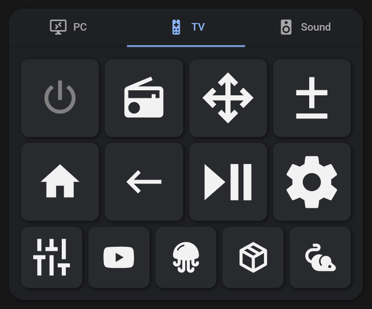

# TabCard for Home Assistant

A custom card for Home Assistant that provides a tabbed interface to easily organize your dashboard entities and cards into neat, switchable views.



## Features

* 📑 Organize multiple cards into neat tabs to save space on your dashboard.
* 🎨 Integrates seamlessly with Home Assistant themes.
* 📱 Fully responsive design for both mobile and desktop screens.

## Installation

### Method 1: HACS (Recommended)

1. Open [HACS](https://hacs.xyz/) in your Home Assistant instance.
2. Go to the **Frontend** section.
3. Click the 3 dots in the top right corner and select **Custom repositories**.
4. Add the URL of this repository and select **Lovelace** as the category.
5. Click **Install** on the new TabCard repository.
6. Reload your browser cache.

### Method 2: Manual

1. Download the compiled `.js` file from the latest release.
2. Copy the file into your `<config>/www/` directory.
3. Go to **Settings** -> **Dashboards** -> **Resources** (you might need to enable Advanced Mode in your user profile to see this).
4. Click **Add Resource**.
5. Enter `/local/tab-card.js` (or whatever you named the file) for the URL and select `JavaScript Module` as the Resource type.
6. Reload your browser cache.

## Configuration

Here is a basic example of how to configure the TabCard in your Lovelace dashboard:

```yaml
type: custom:tab-card
tabs:
  - title: Living Room
    cards:
      - type: entities
        entities:
          - light.living_room_main
          - switch.tv
  - title: Weather
    cards:
      - type: weather-forecast
        entity: weather.home
```

### Options

| Name | Type | Requirement | Default | Description |
| ---- | ---- | ----------- | ------- | ----------- |
| `type` | string | **Required** | | Must be `custom:tab-card`. |
| `tabs` | list | **Required** | | A list of tab objects to render inside the card. |

#### Tab Object Options

| Name | Type | Requirement | Default | Description |
| ---- | ---- | ----------- | ------- | ----------- |
| `title` | string | **Required** | | The text displayed on the tab selector button. |
| `cards` | list | **Required** | | A list of standard Home Assistant cards to display when this tab is active. |

## How to build

If you want to modify or build the card from source, you will need Node.js installed.

1. Clone the repository and navigate to the project directory.
2. Install the dependencies:
   ```bash
   npm install
   ```
3. Build the project:
   ```bash
   npm run build
   ```

The compiled file will be located in the `dist` directory.

## License

This project is licensed under the MIT License.